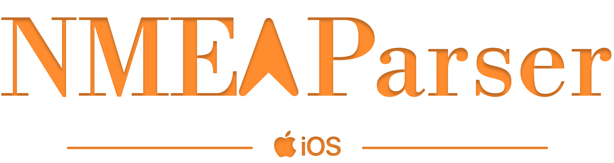

[](https://img.shields.io/badge/Swift-5.9_5.10_6.0-Orange?style=flat-square)
[](https://img.shields.io/badge/Platforms-macOS_iOS-Green?style=flat-square)
[](https://img.shields.io/badge/Swift_Package_Manager-compatible-orange?style=flat-square)

NMEAParser is a Swift package designed to validate and parse National Marine Electronics Association (NMEA) sentences in real time. It is a seamless bridge between your application and GNSS receivers, converting raw NMEA data into a Swift-friendly format—making real-time integration effortless.

## 1 Features

- [x] Swift Concurrency Support Back to iOS 13 and macOS 10.15
- [x] Support for Swift 5 and 6
- [x] Combine Support
- [x] Checksum Validation 
- [x] Descriptions for Fix Types
- [x] GGA Sentences
- [ ] RMC Sentences (coming!)
- [ ] GSV Sentences (coming!)

## 2 Requirements

| Platform                                             | Minimum Swift Version | Installation                                                                                                         | Status                   |
| ---------------------------------------------------- | --------------------- | -------------------------------------------------------------------------------------------------------------------- | ------------------------ |
| iOS 13.0+ / macOS 10.15+ | 5.9 / Xcode 15.0      | [Swift Package Manager](#swift-package-manager) | Fully Tested             |


## 3 Installation

### 3.1 Swift Package Manager

The [Swift Package Manager](https://swift.org/package-manager/) is a tool for automating the distribution of Swift code and is integrated into the `swift` compiler.

Once you set up your Swift package, adding NMEAParser as a dependency is as easy as adding it to the `dependencies` value of your `Package.swift` or the Package list in Xcode.

```swift
dependencies: [
    .package(url: "https://github.com/sindreoyen/NMEAParser.git", .upToNextMajor(from: "1.0.1"))
]
```

## 4 Usage

### 4.1 Configuring the Parser Instance

#### GGA Sentences

You can configure which GGA identifiers you want to include by changing the `supportedGGAIdentifiers` property of the `NMEAParserManager`. E.g., in your App file:

```swift
import NMEAParser

@main
struct YourApp: App {
    // MARK: - Attributes
    // some attributes
    
    // MARK: - Body
    var body: some Scene {
        WindowGroup { ContentView() }
    }
    
    // MARK: - Init
    init() {
        NMEAParserManager.shared.supportedGGAIdentifiers = [.gnGGA, .gpGGA]
    }
}
```

The identifiers used will vary from one GNSS receiver to another. Here is a brief overview of the supported types (see `GGAData.Identifier`):

```swift
public enum Identifier: String, CaseIterable {
        case gnGGA = "$GNGGA" // GGA sentence from GPS and GLONASS
        case gpGGA = "$GPGGA" // GGA sentence from GPS
        case glGGA = "$GLGGA" // GGA sentence from GLONASS
        case gaGGA = "$GAGGA" // GGA sentence from GALILEO
    }
```

### 4.2 Parsing NMEA Sentences

Parsing NMEA sentences is processed by the `NMEAParserManager.shared` instance and has *one interface* that is used for whichever NMEA sentence you want to process. The filtering logic and sending the sentence into the correct parser is handled by the `NMEAParserManager`. For parsing, you have two options:

1. Parse an NMEA sentence already in `String` format

```swift
public func peripheral(_ peripheral: CBPeripheral,
                           didUpdateValueFor characteristic: CBCharacteristic,
                           error: Error?) {
        if let error { print(error); return }
        // Send the updated value of the characteristic to the NMEA parser
        guard let nmeaSentence: String = someConverterMethod(characteristic.value) else { return }
        NMEAParserManager.shared.process(sentence: nmeaSentence)
    }
```

2. Parse a `Data?` instance (e.g., the value of your GNSS receiver's `CBCharacteristic`)

```swift
public func peripheral(_ peripheral: CBPeripheral,
                           didUpdateValueFor characteristic: CBCharacteristic,
                           error: Error?) {
        if let error { print(error); return }
        // Send the updated value of the characteristic to the NMEA parser
        //
        // The default encoding for the `process` method is .ascii
        NMEAParserManager.shared.process(sentence: characteristic.value, encoding: .ascii)
    }
```

### 4.3 Listening to Parsed Data

#### GGA Sentences

The parsed GGA data will be exposed under two `AnyPublisher` instances (`ggaDataPublisher: AnyPublisher<GGAData, Never>` and `rawGGASentencePublisher: AnyPublisher<String, Never>`). These are available via `NMEAParserManager.shared`. *If you are unfamiliar with [The Combine Framework](https://developer.apple.com/documentation/combine) and its Subjects, Publishers, and Cancellables, please read the linked documentation.*

Example with `ggaDataPublisher` (for in-app display and use of data):
```swift
@MainActor
func startListeningForGGAData() {
    ggaCancellable?.cancel()
    ggaCancellable = NMEAParserManager.shared.ggaDataPublisher
        .throttle(for: .seconds(1), scheduler: DispatchQueue.main, latest: true)
        .sink { [weak self] ggaData in
            guard let self else { return }
            self.hdop = ggaData.hdop
            self.ggaFixType = ggaData.fixType
        }
}
```

Example with `rawGGASentencePublisher` (e.g., for NTRIP Client functionality):

```swift
self.ggaCancellable = NMEAParserManager.shared.rawGGASentencePublisher
                .throttle(for: .seconds(10),
                          scheduler: DispatchQueue.global(qos: .background),
                          latest: true)
                .receive(on: DispatchQueue.global(qos: .background))
                .sink { [weak self] ggaMessage in
                    guard let self = self else { return }
                    print("NTRIPClient: Sending GGA message: \(ggaMessage)")
                    self.sendGGAToCaster(ggaMessage)
                }
```

## 4.4 Communication

- If you **find a bug**, open an issue here on GitHub. The more detail the better!

## 5 Contributing

Contributions are welcome. To contribute, first open an issue where you explain the bug or feature in full detail. If you have performed the necessary changes, open a PR, and I will review it continuously. 

*note: pull requests will not be accepted if they do not follow an acceptable standard regarding documentation, test coverage, and code style. Use Swiftlint to validate code styling (see Makefile).*
